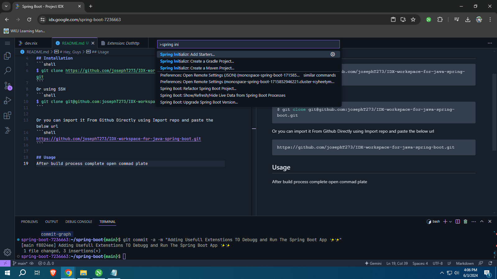
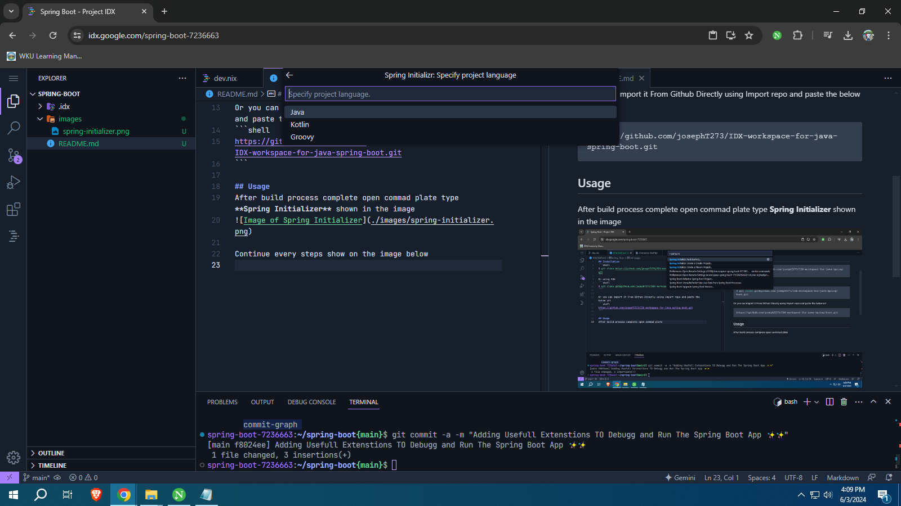
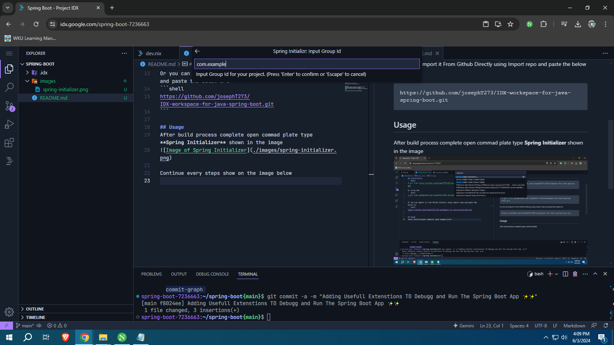
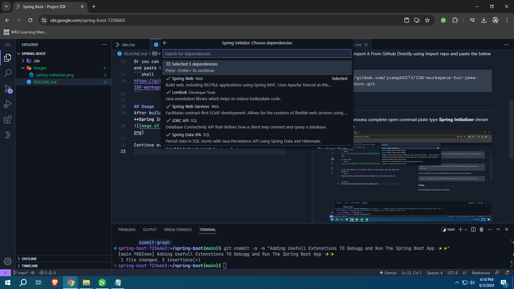
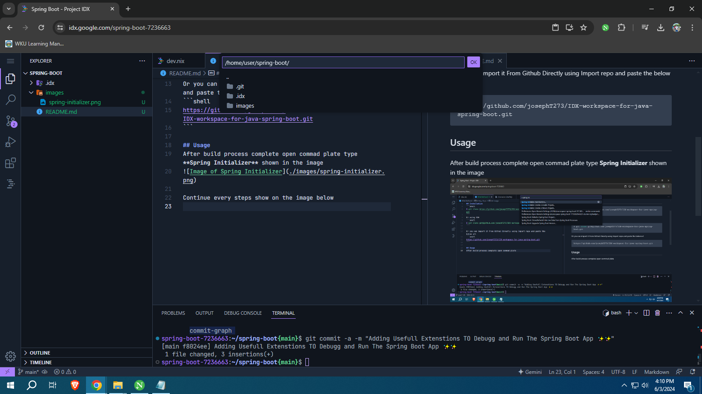

# Hey, Guys
whats up I'm Joseph From Ethiopia This is my IDX WOrkspace Setup for my Spring Boot project. If You want to create your own Spring Boot App You can use this workspace.

## Installation
```shell
$ git clone https://github.com/josephT273/IDX-workspace-for-java-spring-boot.git
```
Or using SSH
```shell
$ git clone git@github.com:josephT273/IDX-workspace-for-java-spring-boot.git
```

Or you can import it From Github Directly using Import repo and paste the below url
```shell
https://github.com/josephT273/IDX-workspace-for-java-spring-boot.git
```

## Usage
After build process complete open commad plate type **Spring Initializer** shown in the image


Continue every steps show on the image below

Select Spring boot version and hit Enter


Select Programming language I use java


Input Group Id for your project and hit enter


Input Artifact Id for your project and hit enter


Select Specfic packaging type


Select version of java for your procject I use Java 17 for now


Add dependencies for your project and hit enter


Select Appropriate direction for your project and click Ok


Start your project
```shell
$ cd demo
$ ./mvnw install
$ ./mvnw spring-boot:run
```

## Happy Coding✨
Thanks for using my workspace

[Contact Me Linktree](https://linktr.ee/josepht273)
